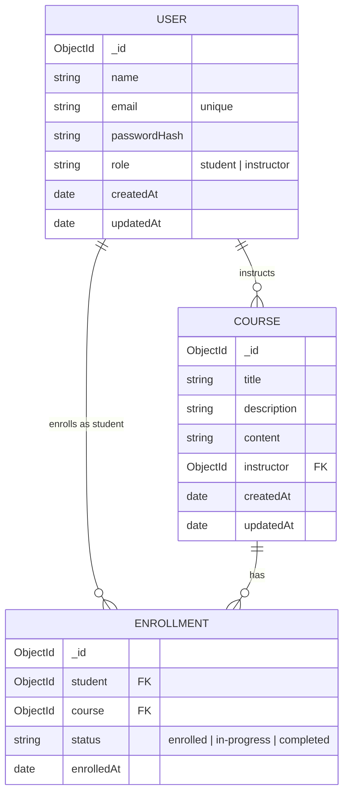

# Database Structure

MongoDB via Mongoose. Three collections: `users`, `courses`, `enrollments`.

## Entity-relationship diagram

## Collections

### `users`
| Field | Type | Notes |
|---|---|---|
| `name` | String | required |
| `email` | String | required, unique, stored lowercase |
| `passwordHash` | String | bcrypt hash, never the raw password |
| `role` | String | enum: `student`, `instructor` (`admin` exists in the enum for future use but has no registration path or permissions — currently inert) |

### `courses`
| Field | Type | Notes |
|---|---|---|
| `title` | String | required |
| `description` | String | required |
| `content` | String | required — course body/syllabus text |
| `instructor` | ObjectId → `users` | required |

**Indexes:** compound unique index on `(instructor, title)` — an instructor can't have two courses with the same title (prevents accidental duplicate creation, e.g. a double form submit).

### `enrollments`
| Field | Type | Notes |
|---|---|---|
| `student` | ObjectId → `users` | required |
| `course` | ObjectId → `courses` | required |
| `status` | String | enum: `enrolled` (default), `in-progress`, `completed` — self-reported by the student, drives the progress bar on My Courses |
| `enrolledAt` | Date | set automatically on creation |

**Indexes:** compound unique index on `(student, course)` — a student can't enroll in the same course twice.

**Cascade behavior:** deleting a course also deletes all `enrollments` referencing it (handled in the application layer, in `deleteCourse`), so a removed course never leaves orphaned enrollment records pointing at nothing.

## Design notes

- Enrollment status is a simple 3-stage self-reported field rather than granular lesson/module completion tracking — the course model doesn't have a lesson/module structure (just a single `content` text field), so there's nothing more granular to track yet. This maps directly to the brief's "display the status of their enrollments" requirement.
- Course content is a single text field rather than structured modules/lessons, matching the brief's course schema ("title, description, instructor, and content").
